<picture><source media="(prefers-color-scheme: dark)" srcset="assets/v1/hero-dark.svg"></picture>

  <a href="https://talkdedsec.com/en">Site</a>
  &nbsp;·&nbsp;
  <a href="https://code.talkdedsec.com">Editor</a>
  &nbsp;·&nbsp;
  <a href="PROJECTS.md">Projects</a>
  &nbsp;&nbsp;|&nbsp;&nbsp;
  <a href="README.tr.md"><b>Türkçe</b></a>

<picture><source media="(prefers-color-scheme: dark)" srcset="assets/v1/rule-dark.svg"></picture>

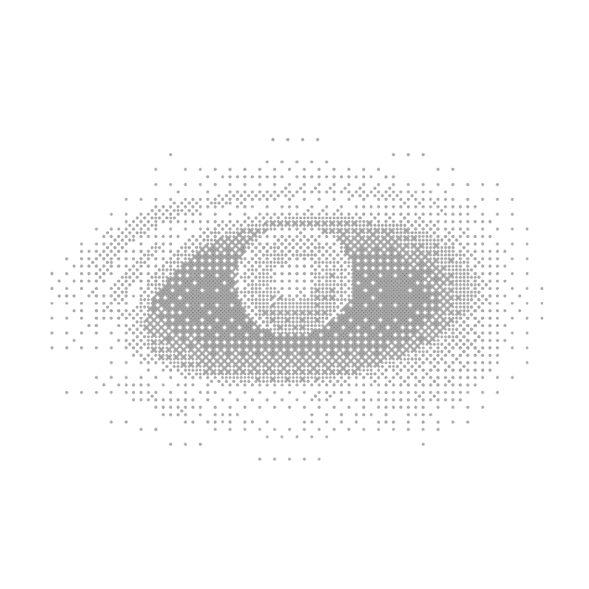

I run a small studio and build everything listed here: a Windows code editor, a catalogue of browser tools and games, a FiveM script store, and the licensing and deployment layer that keeps them running.

Most of it ships as a product, not a demo — installers, update channels, licence checks and a support inbox. None of it carries analytics or usage tracking; the licensed products check a licence key and send nothing else. No sponsors either.

 

  <picture><source media="(prefers-color-scheme: dark)" srcset="assets/v1/pil-desktop-dark.svg">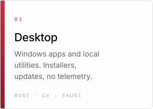</picture>
  <picture><source media="(prefers-color-scheme: dark)" srcset="assets/v1/pil-web-dark.svg">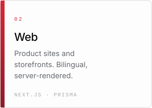</picture>
  <picture><source media="(prefers-color-scheme: dark)" srcset="assets/v1/pil-systems-dark.svg">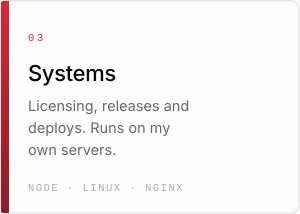</picture>
  <picture><source media="(prefers-color-scheme: dark)" srcset="assets/v1/pil-interactive-dark.svg">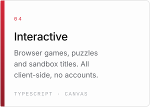</picture>

<picture><source media="(prefers-color-scheme: dark)" srcset="assets/v1/metrics-dark.svg">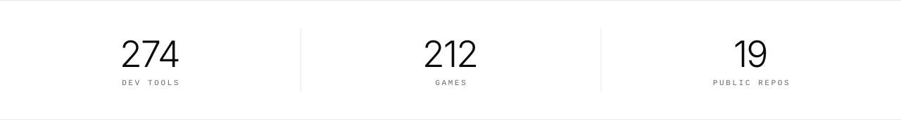</picture>

<picture><source media="(prefers-color-scheme: dark)" srcset="assets/v1/h-featured-dark.svg"></picture>

  <a href="https://github.com/Talkdedsec/tlk-sentinel"><picture><source media="(prefers-color-scheme: dark)" srcset="assets/v1/feat-sentinel-dark.svg">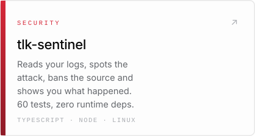</picture></a>
  <a href="https://github.com/Talkdedsec/tlk-visual"><picture><source media="(prefers-color-scheme: dark)" srcset="assets/v1/feat-visual-dark.svg">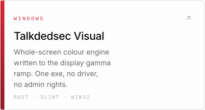</picture></a>
  <a href="https://github.com/Talkdedsec/tlk-wymcmd"><picture><source media="(prefers-color-scheme: dark)" srcset="assets/v1/feat-wymcmd-dark.svg">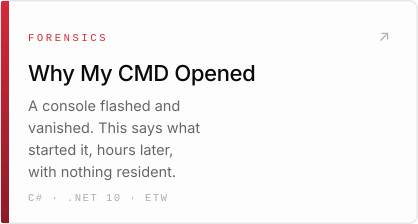</picture></a>

<picture><source media="(prefers-color-scheme: dark)" srcset="assets/v1/h-sites-dark.svg">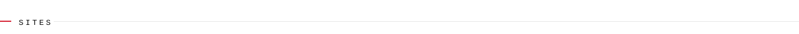</picture>

  <a href="https://talkdedsec.com/en"><picture><source media="(prefers-color-scheme: dark)" srcset="assets/v1/site-main-dark.svg">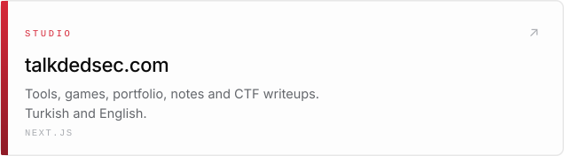</picture></a>
  <a href="https://code.talkdedsec.com"><picture><source media="(prefers-color-scheme: dark)" srcset="assets/v1/site-code-dark.svg">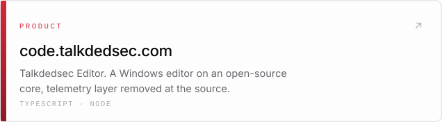</picture></a>
  <a href="https://projects.talkdedsec.com"><picture><source media="(prefers-color-scheme: dark)" srcset="assets/v1/site-projects-dark.svg">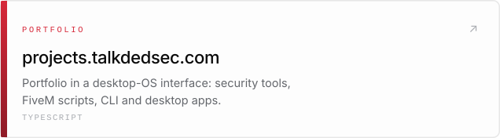</picture></a>
  <a href="https://store.talkdedsec.com"><picture><source media="(prefers-color-scheme: dark)" srcset="assets/v1/site-store-dark.svg">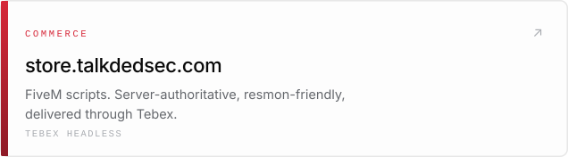</picture></a>
  <a href="https://ornek.talkdedsec.com"><picture><source media="(prefers-color-scheme: dark)" srcset="assets/v1/site-ornek-dark.svg">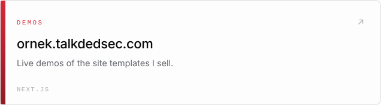</picture></a>
  <a href="https://flypen.com.tr"><picture><source media="(prefers-color-scheme: dark)" srcset="assets/v1/site-flypen-dark.svg">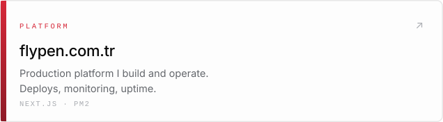</picture></a>

<picture><source media="(prefers-color-scheme: dark)" srcset="assets/v1/h-catalogue-dark.svg">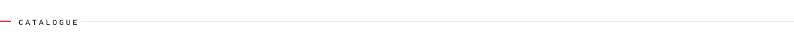</picture>

  <a href="https://talkdedsec.com/tools"><picture><source media="(prefers-color-scheme: dark)" srcset="assets/v1/cat-tools-dark.svg">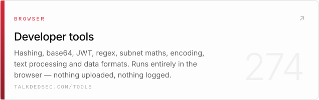</picture></a>
  <a href="https://talkdedsec.com/games"><picture><source media="(prefers-color-scheme: dark)" srcset="assets/v1/cat-games-dark.svg">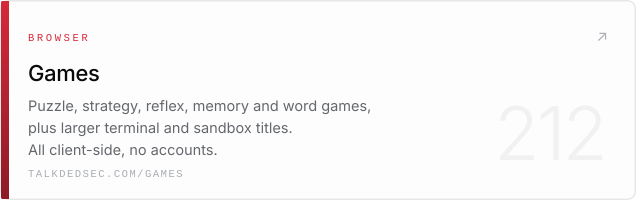</picture></a>

<picture><source media="(prefers-color-scheme: dark)" srcset="assets/v1/h-oss-dark.svg">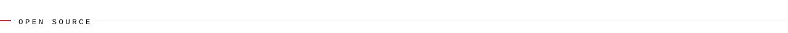</picture>

<!-- OSS:START -->
| Repository | What it is | Stack | Updated |
|:--|:--|:--|:--|
| **[tlk-hex](https://github.com/Talkdedsec/tlk-hex)** · 2 ★ | Interactive disassembler — static analysis / reverse engineering for x86/x64 PE, ELF and raw binaries | `C#` `csharp` `decompiler` | 08 Oct 2026 |
| **[clipdeck](https://github.com/Talkdedsec/clipdeck)** | Windows için hızlı ve şifreli pano geçmişi, emoji, kaomoji ve sembol seçici — Win+V ve Win+. yerine. | `C#` `clipboard` `clipboard-history` | 06 Oct 2026 |
| **[scoop-tlk](https://github.com/Talkdedsec/scoop-tlk)** | Scoop bucket for the Talkdedsec Windows tools - wymcmd and tlk-visual. | `package-manager` `scoop` | 06 Oct 2026 |
| **[tlk-visual](https://github.com/Talkdedsec/tlk-visual)** · 2 ★ | Whole-screen colour engine for Windows, written straight to the display gamma ramp. One exe, no driver, no admin rights. | `Rust` `Slint` `Win32` | 06 Oct 2026 |
| **[tlk-grid](https://github.com/Talkdedsec/tlk-grid)** | Window layout, zoom and overlays for games. Win32 and DWM only, no injection. | `Rust` `dwm` `gaming` | 06 Oct 2026 |
| **[fit-to-kb](https://github.com/Talkdedsec/fit-to-kb)** | Compress images to a target KB size in your browser. Private, free, English and Turkish. Batch processing and ZIP downloads. | `TypeScript` `browser` `github-pages` | 05 Oct 2026 |
| **[easy-calc](https://github.com/Talkdedsec/easy-calc)** | Percentage, discount, increase and VAT calculator. Mobile-friendly, private, English and Turkish. | `TypeScript` `calculator` `discount` | 05 Oct 2026 |
| **[tlk-pass](https://github.com/Talkdedsec/tlk-pass)** | Offline password generator powered by the Web Crypto API. One HTML file, zero dependencies, zero network requests. | `HTML` `JavaScript` | 05 Oct 2026 |
| **[tlk-wymcmd](https://github.com/Talkdedsec/tlk-wymcmd)** · 1 ★ | Finds out what launched that console window — scheduled task, service, registry key or click — hours after it closed. | `C#` `.NET 10` `ETW` | 05 Oct 2026 |
| **[tlk-sentinel](https://github.com/Talkdedsec/tlk-sentinel)** | Server and application security engine: log-driven attack detection, IP banning, reputation and anomaly scoring, live panel. | `TypeScript` `Node` `SQLite` | 05 Oct 2026 |
| **[tlk-wsmf](https://github.com/Talkdedsec/tlk-wsmf)** | Finds out which Windows application steals your keyboard focus, and stops it. Tray program in Rust, no keyboard hook, English and Turkish. | `Rust` `egui` `focus-stealing` | 05 Oct 2026 |
| **[tlk-tune](https://github.com/Talkdedsec/tlk-tune)** | Terminal music player for Windows. One executable, no ffmpeg, mouse and keyboard, album art, synced lyrics, ten-band EQ. | `Rust` `audio` `cli` | 05 Oct 2026 |

Synced 08 Oct 2026 · public repositories only
<!-- OSS:END -->

<a href="PROJECTS.md"><b>Full project index →</b></a>

<picture><source media="(prefers-color-scheme: dark)" srcset="assets/v1/h-stack-dark.svg"></picture>

  <code>TypeScript</code> <code>JavaScript</code> <code>Rust</code> <code>C#</code> <code>Go</code> <code>Python</code> <code>Lua</code> <code>PowerShell</code> <code>SQL</code> 
  <code>Next.js</code> <code>React</code> <code>Node.js</code> <code>Tauri</code> <code>Prisma</code> <code>PostgreSQL</code> <code>Redis</code> 
  <code>Linux</code> <code>nginx</code> <code>PM2</code> <code>systemd</code> <code>GitHub Actions</code> <code>Playwright</code> <code>Sentry</code> <code>Tebex</code>

<picture><source media="(prefers-color-scheme: dark)" srcset="assets/v1/rule-dark.svg"></picture>

  <a href="mailto:talkdedsec@proton.me">talkdedsec@proton.me</a>
  &nbsp;·&nbsp;
  <a href="https://talkdedsec.com/contact">Contact</a>
  &nbsp;·&nbsp;
  <a href="https://talkdedsec.com/tools">Tools</a>
  &nbsp;·&nbsp;
  <a href="https://talkdedsec.com/games">Games</a>
  &nbsp;·&nbsp;
  <a href="https://github.com/talkdedseccode">Editor releases</a>
  &nbsp;·&nbsp;
  <a href="https://talkdedsec.com/blog">Blog</a>
  &nbsp;·&nbsp;
  <a href="https://talkdedsec.com/writeups">Writeups</a>

  

